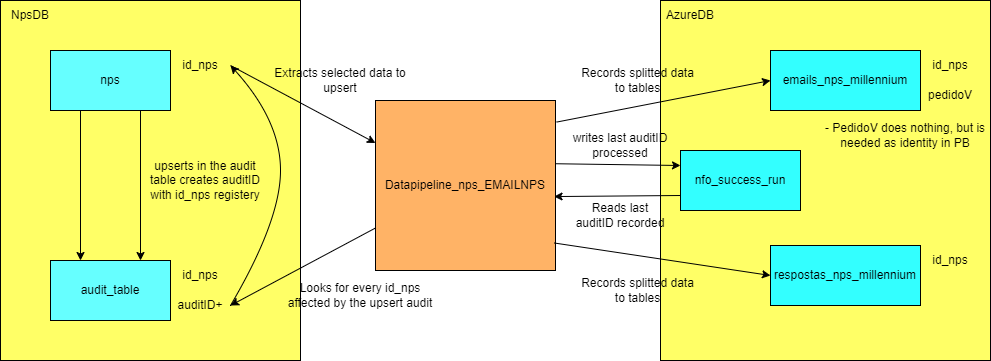

# datapipeline_NPS_EMAILNPS
 Datapipe for the NPS database running an GET NPS emails to Azure DataMart (BI)

The pipe uses a recorded value of auditID in azureDB to only upsert new or updated information on AzureDB since npsDB don't have a way of tracking which id_nps was updated or inserted like a trasactional incremental value.
The audit_table was created to contain information when changes (insert/update) happens in the nps.nps table with the setted triggers. Also, for every new interaction, a new auditID is generated.

When the pipeline runs, the last auditID is recorded in nfo_successrun table and that information is used for the next interaction.

The data is split into two other tables (legacy of older projects) to be consumed by powerBI. Some data is only needed because of the legacy project.

This project saved as backup the legacy tables (historico_emails_nps_millennium and historico_respostas_nps_millennium). This project also deactivated nps_millennium integration on integrations table. (set to 1)

Although the names of the tables weren't changed, the data now comes from nps database instead of millennium. 

# diagram of the project
 

------------------------------------------------------------------------------------------

[INI] Initial commit  
[FCT] Description (New functionality added)  
[BUG.xx] Bug description (When solved) (For bugs – xx: Bug number in the issue tracker).  
[WIP] Description (Work in Progress – Lacks testing)  
[UPD] Updated to version 1.x.y (New Release – Can go to production)  
[DOC] Added doc (New Documentation)  
[QLTY] Description (Code refactoring and general beauty parameters)  
[OPT] Description (Optimizations – The code has been optimized)  
[PDN] Description (Feature pending)  
[RMV] Description (Removed)  
[COR] Description (Correction)  